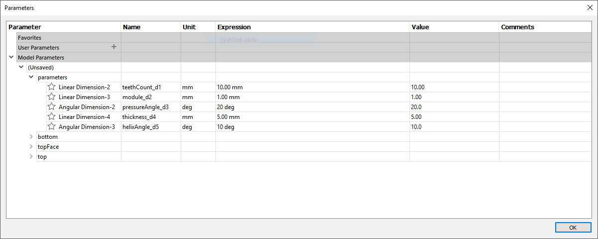
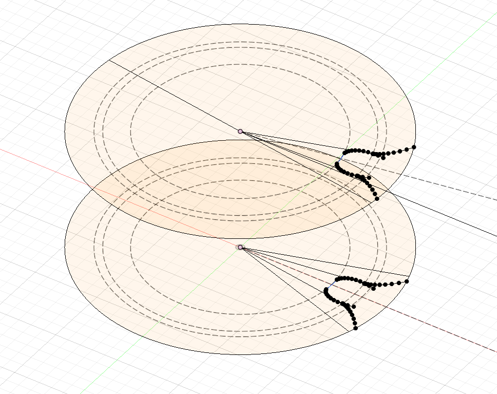

# YSpurGear

If you are like me, you regularly go back in the timeline and tweak stuff during
the design process in Fusion 360. The existing gear generators don't allow you
to do that. Once you enter the parameters, they cannot be changed. You can only
re-run the generator; however, it will break your history and references. Also,
many of the ready generators do not correctly generate under-cuts.

YSpurGear generator fixes all the problems above. Its usage is simple. Just run
the script, and it will generate three sketches: parameters, bottom, and top.
The parameters sketch contains all the parameters of the gear. I prefer to edit
these parameters using the parameters window, where you can see the names:

The bottom and top sketches provide a drawing of a single tooth. You can use the
extrude command for spur gears or the loft command for helical gears to create
the body. Then apply the circular pattern on the last operation to obtain the
body of the full gear.

## Tips
- First, extrude a small circle in the middle of the gear. Then choose "join" as
  a body operation in your loft or extrude command. This yields a single body
  from the circular pattern, rather than multiple bodies.
- To create a herringbone gear, mirror the gear using the top face.